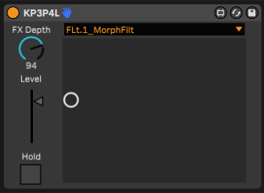

# KP3P4L

## This project is archived and no longer actively developed
After much effort, I've come to the conclusion that the concept of M4L-based controllers for hardware synths is fatally flawed. Moreover, I've ditched Ableton for Bitwig, so I'm basically done with Max4Live. If you think you can make this work, have at it. I've given up.

KP3P4L is a Max for Live controller for the Korg Kaoss Pad 3+.  
